# Semantic Skill Matching

Solução de mapeamento semântico entre skills brutas de colaboradores e uma
taxonomia padronizada, usando sentence embeddings e cosine similarity.

## Problema

Skills são registradas de formas muito diferentes dependendo da empresa, cargo
e contexto. `"gestão de pessoas"`, `"People Management"` e `"liderança de times"`
podem representar a mesma competência — ou não. Este projeto automatiza esse
mapeamento com indicação de confiança e rejeição explícita quando não há match
adequado.

## Abordagem



1. **Pré-processamento:** normalização seletiva do texto de entrada — strings
   completamente em maiúsculo com mais de 4 caracteres são convertidas para
   minúsculo (`PYTHON` → `python`), preservando siglas curtas (`AWS`, `ETL`)
   e capitalização mista (`Git`, `PowerBI`)
2. **Embedding:** cada skill da taxonomia (nome + descrição concatenados) e
   cada skill bruta são transformadas em vetores densos de 384 dimensões
3. **Matching:** cosine similarity entre cada skill bruta e todas as 100 skills
   da taxonomia; threshold calibrado via curva Precision-Recall
4. **Decisão:** score ≥ 0.45 → `matched`; score < 0.45 → `no_match` explícito

## Resultados

Avaliados sobre ground truth manual com 46 pares anotados (threshold = 0.45,
normalização seletiva):

| Métrica | Valor |
|---|---|
| Precision | 0.976 |
| Recall | 0.891 |
| F1 | 0.932 |
| Coverage | 0.84 |

Skills sem correspondência na taxonomia (`espiritualidade`,
`Alinhamento com o universo`) são corretamente rejeitadas como `no_match`
em toda a faixa de threshold testada (0.30–0.90).

## Estrutura
```
data/
  raw/          # CSVs de input (new_skills.csv, skill_taxonomy.csv)
  output/       # Resultado do mapeamento
notebooks/
  01_exploration.ipynb         # Pipeline completo + avaliação sintética
  02_manual_annotations.ipynb  # Ground truth manual + comparação
src/
  embedder.py   # SkillEmbedder — normalização e geração de embeddings
  matcher.py    # SkillMatcher — cosine similarity e decisão de match
  evaluator.py  # Métricas, curva PR e distribuição de scores
  match.py      # CLI principal
DECISIONS.md    # Registro de decisões técnicas e trade-offs
requirements.txt
```

## Setup
```bash
python -m venv .venv
source .venv/bin/activate   # Windows: .venv\Scripts\activate
pip install -r requirements.txt
```

## Uso
```bash
python src/match.py \
  --skills data/raw/new_skills.csv \
  --taxonomy data/raw/skill_taxonomy.csv \
  --output data/output/result.csv \
  --threshold 0.45
```

## Output

| Campo | Descrição |
|---|---|
| `skill_raw` | Skill original do input |
| `taxonomy_id` | ID na taxonomia (vazio se no-match) |
| `taxonomy_name` | Nome padronizado |
| `score` | Cosine similarity (0 a 1) |
| `match_status` | `matched` ou `no_match` |

## Decisões técnicas

Documentadas em [`DECISIONS.md`](DECISIONS.md) — inclui comparação entre
três estratégias de normalização e justificativa do threshold escolhido.